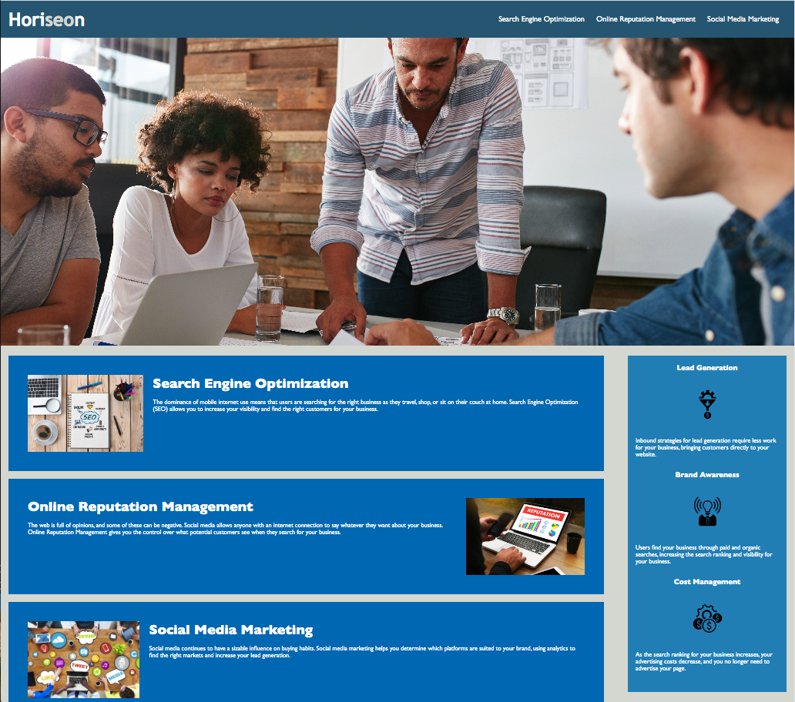

# Horiseon Main Page Refactor

## Description

The motivation for this project was to refactor a pre-existing webpage's HTML and CSS format so that it is more accessible for people with disabilities, who need assistive devices such as screen readers to get information from a page. We also wanted to optimize SEO for the webpage so that it can be found more easily. With the refactoring of the HTML code, we achieve the goals above but, by also consolidating the CSS and adding comments, we help any future developers who view this webpage's code and, want make changes or add more features. Through this process, I've learned that you should be mindful of how you structure and label your code as you develop it and make sure that there is a way that it can be accessible to everyone. 

## Updates

* Changed div tags and replaced with "header", "main", "footer", "section" tags

* Added "nav" tag as a parent container for the "ul"(unordered list)

* Connected CSS to use more elemental attributes 

* Added alternative text to figures and pictures for more accessibility

* Condensed CSS attributes for more robust and understandable code

## Usage

The way to use this webpage is to look at it as a template for how to structure your HTML and CSS code so that it benefits all users and developers.

## Demo

This is what the following webpage looks like:

## Deployed Application

Check out the live page at: https://keysbhag.github.io/Module1Challenge/

## Credits

Keyshawn Bhagwandin

## License
N/A

---
© 2022 Keysbhag. Confidential and Proprietary. All Rights Reserved.